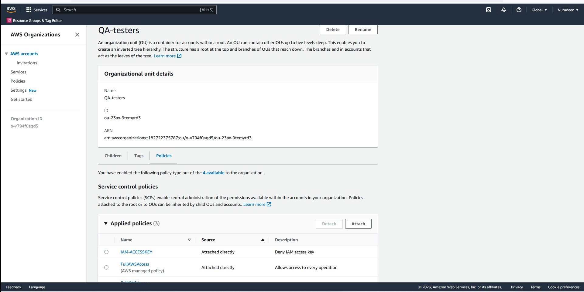
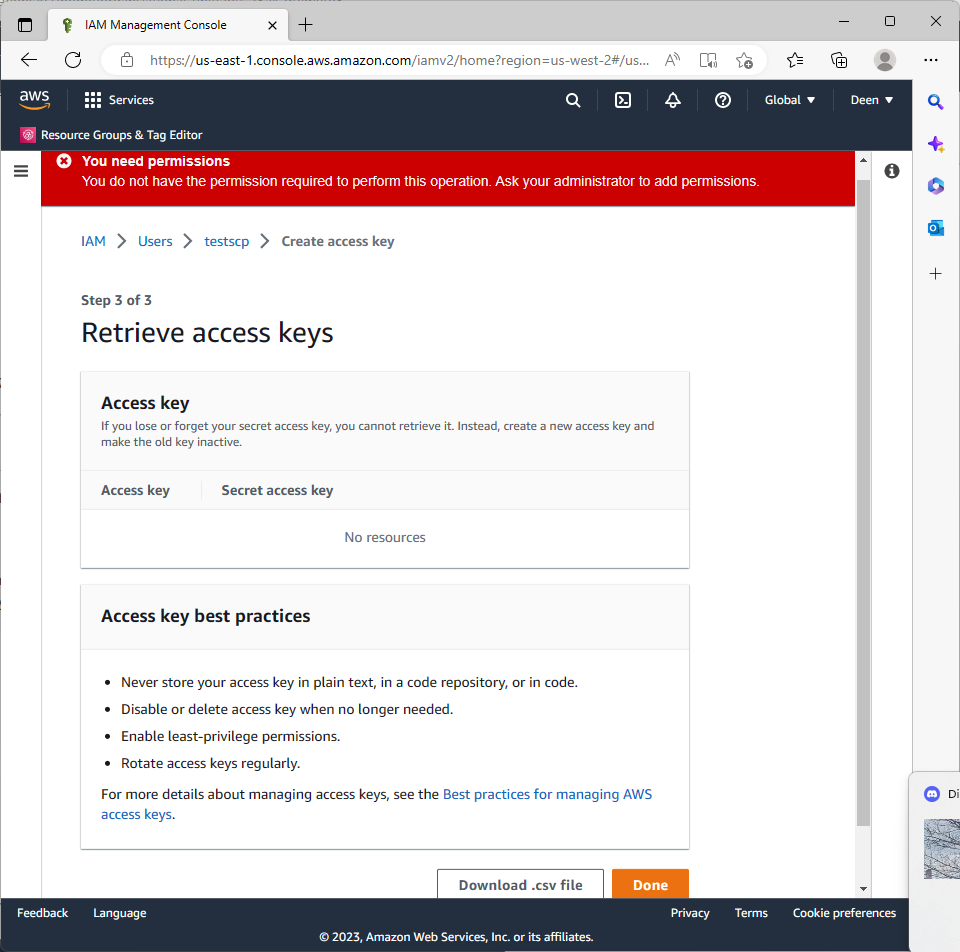
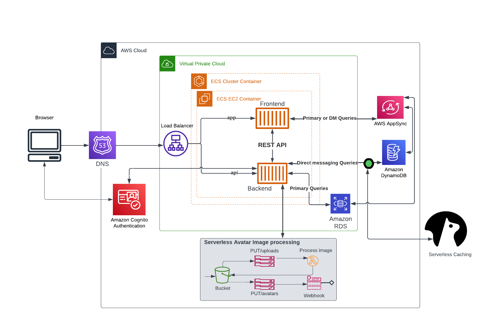
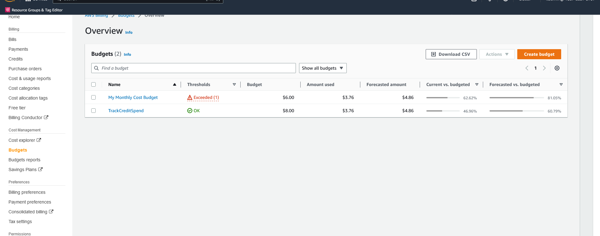
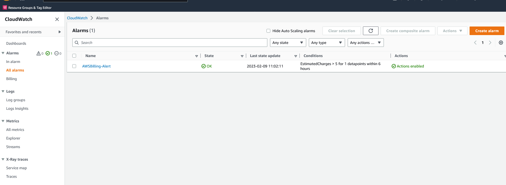
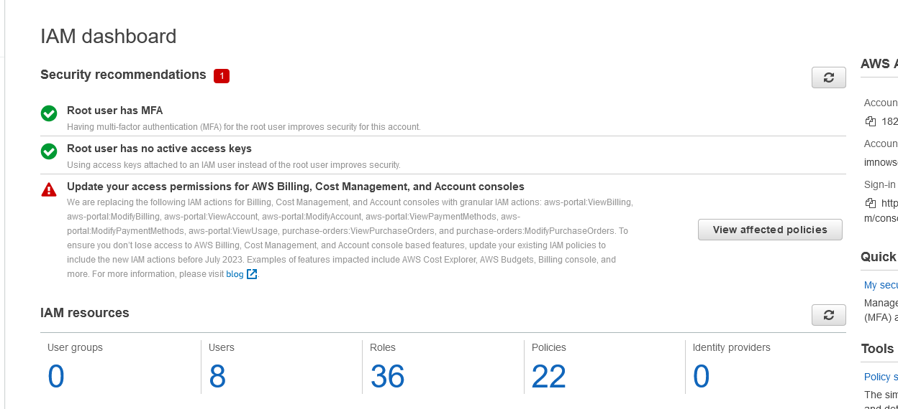
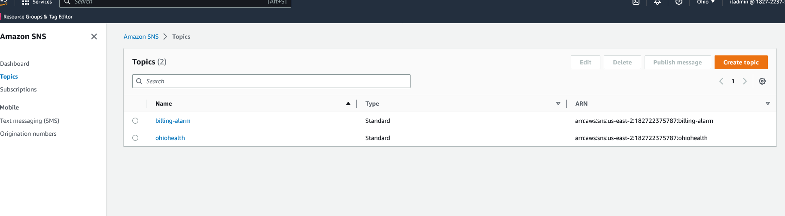

# Week 0 — Billing and Architecture

HERE ARE THE OVERVIEW FOR WEEK-0 (Feb12-18)

- Participate in the live stream video, rewatched it again and take notes.

- Studied the AWS Well-Architected Framework. 
- Document key point in SECURITY - such as How you detect and investigate security events, How do you classify your data.
- Document key point in Operational Excellence - such as How you structure your organization to support your business outcomes.
- Document key point in Reliability - such as How do you design your workload service architecture.
- Document key point in Performance Efficiency - such as How do you select your database solution.
- Document key point in Cost Optimization - such as How do you meet cost targets when you select resource type, size and number.
- Document key point in Sustainability - such as How do you select Regions to support your sustainability goals.

- Set up AWS Organization, added an account, move user account to QA organization unit and created a policy to deny creation of IAM access key.

- Created Logical Architectual Diagram in Lucid Charts and submitted only to find out that Amazon RDS image is not inside the VPC so i modified the Diagram and made some adjustments.

- Created Conceptual Diagram in Lucid Charts.

- Installed AWS CLI and configured it on gitpod, then i export the access keys, that way i don't have to reconfigure AWS CLI everytime am working in the gitpod workspace.

- AWS CLI to create a Budget and Billing Alarm on gitpod and i also printed all the history of all the commands used to provision the budget and billing alarm,   i save them on txt file in my week-0 branch and push them on github.

- Created mulitple users and set up MFA on my Root account and also user account.

- Created SNS topic notification via email for the budget and billing.

