Week 1 — App Containerization

HERE ARE THE OVERVIEW FOR WEEK-1 (Feb18-25)

- Watched the live stream video and take notes

- Watched the Grading Homework Summaries and from my understanding we only need the main branch, I already created new branch for week-0 and my assignment for week-0 are in the branch, So i did merge the week-0 branch to the Main branch. I resolve the conflicts by adding all the commits and push. 
 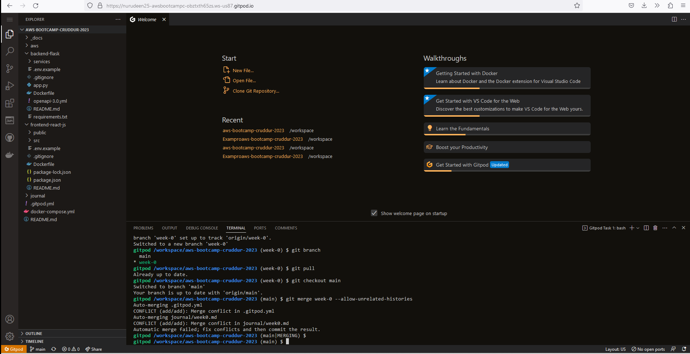
 
- I did commit my code and push to my git repository

- I watched Chirag's week-1 Spending considerations 

- Watched Ashish's Week-1 Container Security Considerations and play with it
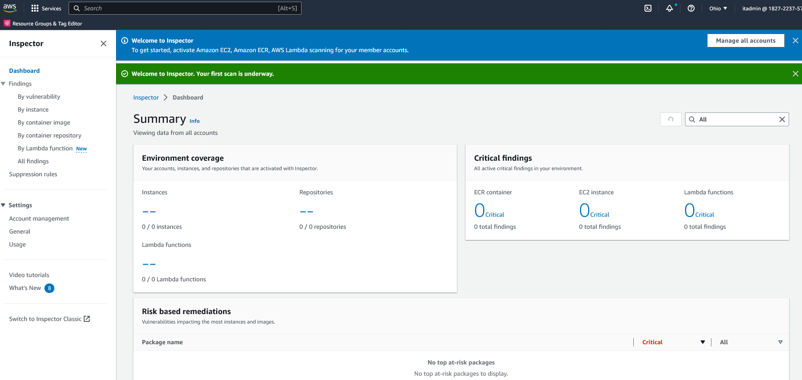
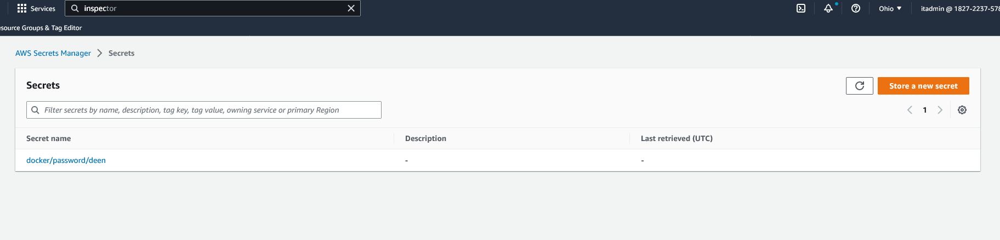
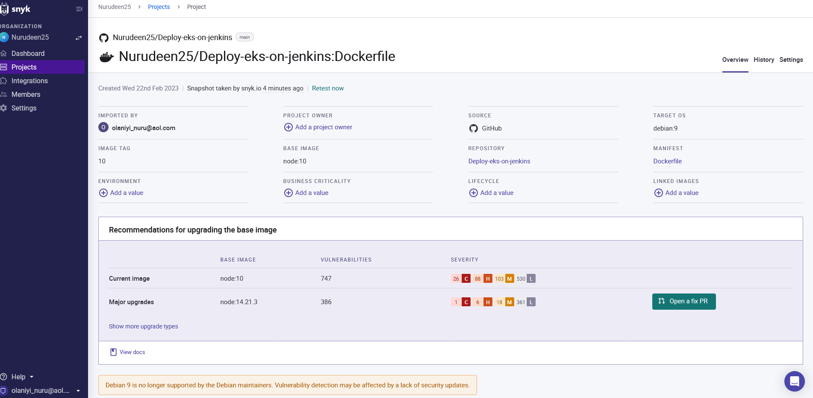
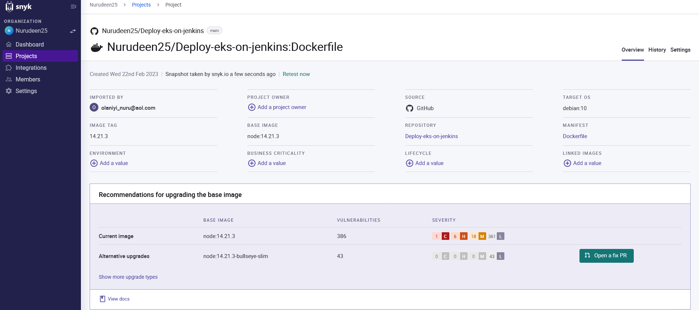

- I did create Dockerfile and docker-compose file for Containerize Application, commit and push to my repository

- I document the Notification Endpoint for the OpenAI Document
 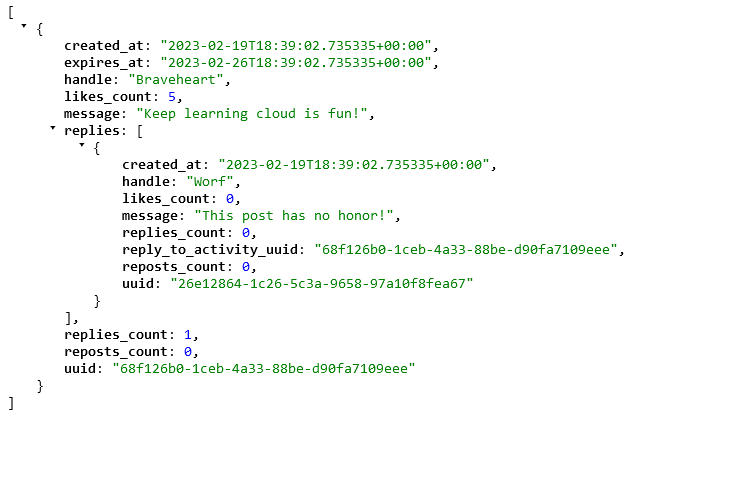
 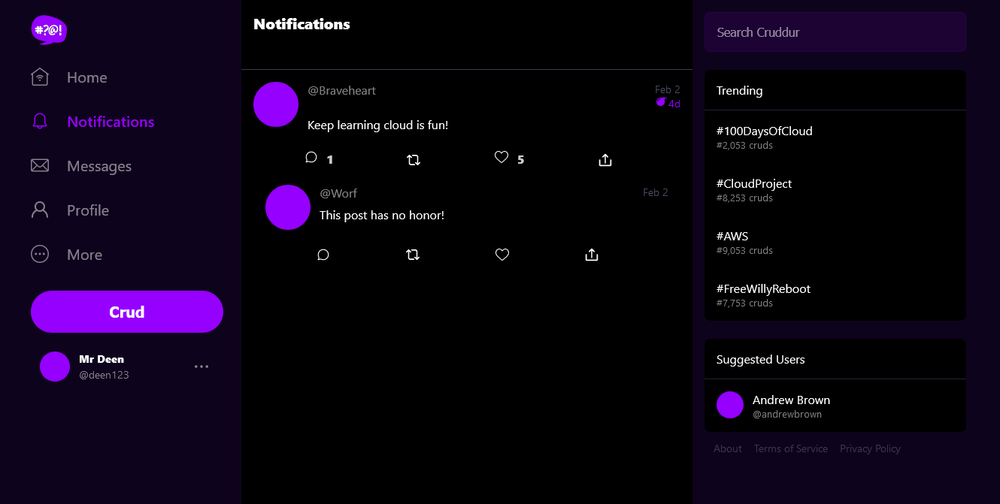
 
- I implement Flask Backend Endpoint for Notifications
 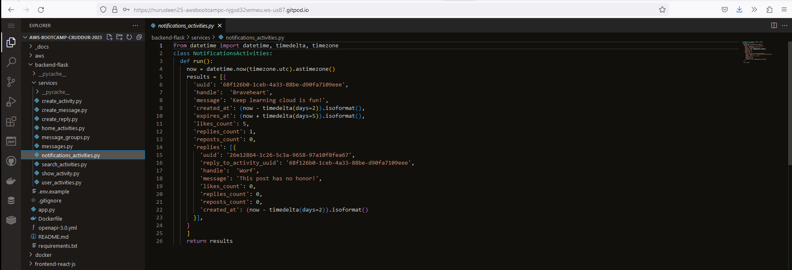

- I implement React Page for Notifications
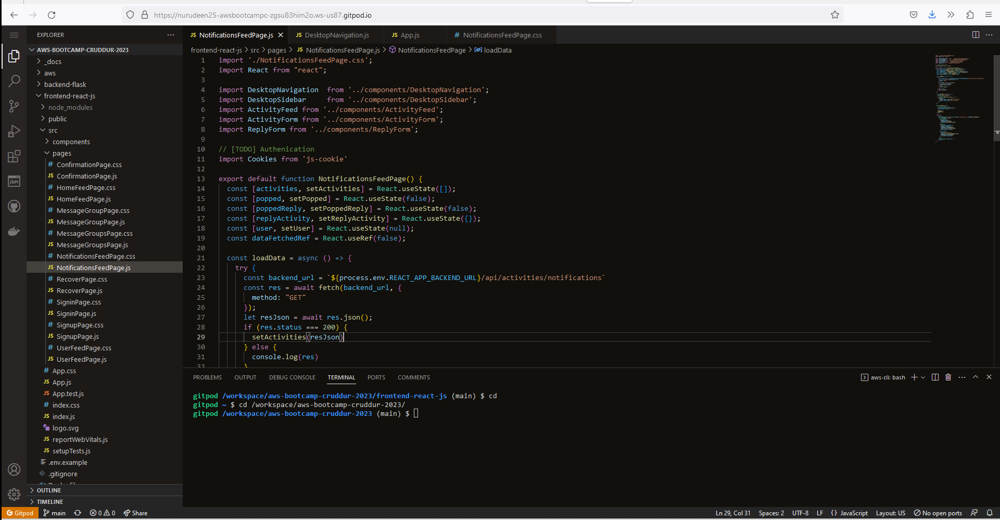

- I run DynamoDB Local Container and it works
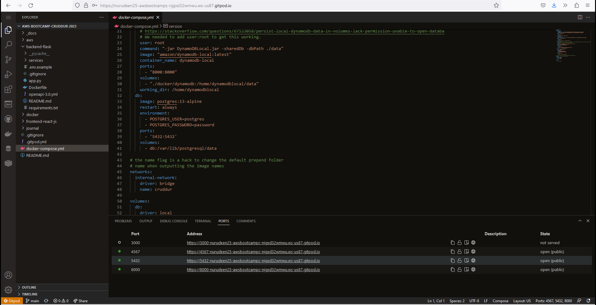

- I run Postgres Container and it works
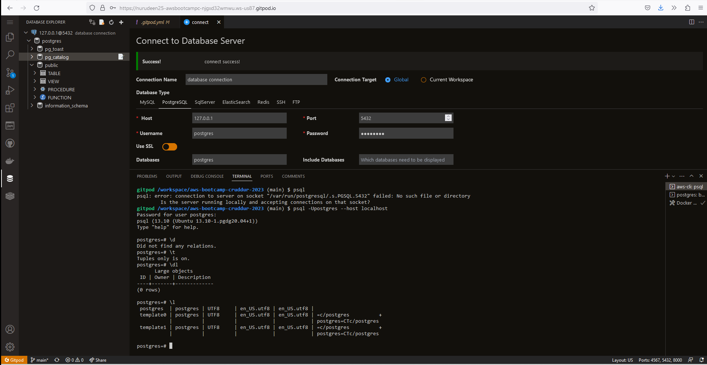
