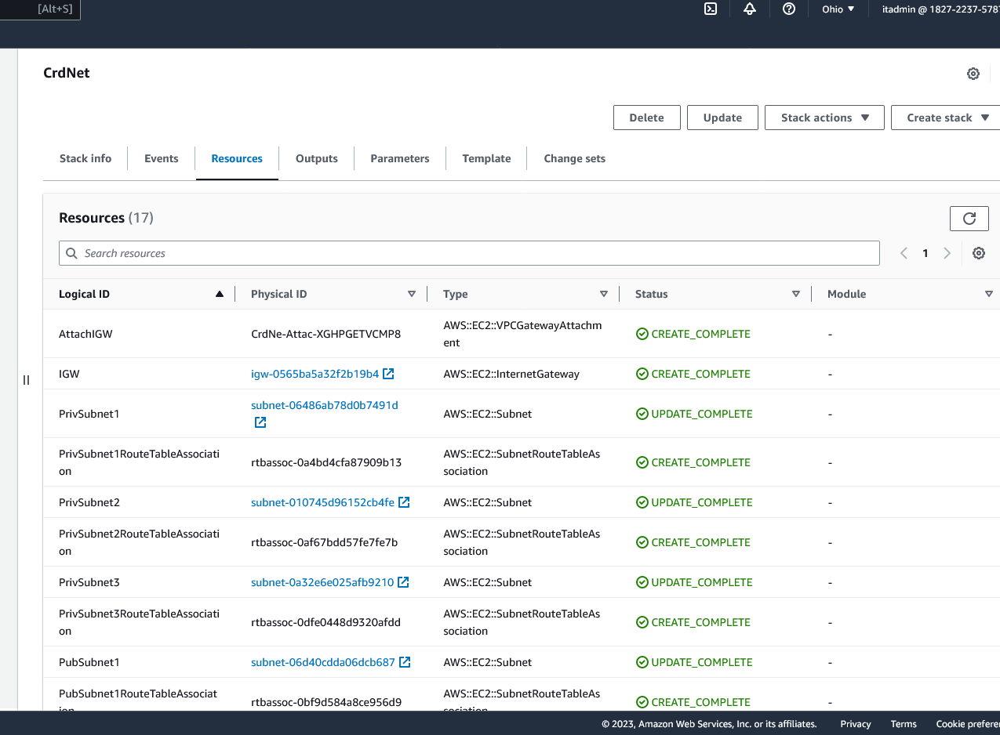

# Week 10 and 11 — CloudFormation Part 1

Before I run any templates, I create an s3 bucket to contain all of our artifacts for cloudformation and I set the env on my gitpod environment.

```sh
aws s3 mk s3://cfn-harvestdam-artifacts
export CFN_BUCKET="cfn-harvestdam-artifacts"
gp env CFN_BUCKET="cfn-harvestdam-artifacts"
```

I Implement CFN Networking Layer. I use TOML to define my configuration file and parameters. TOML aims to be a minimal configuration file format. You can easily install cfn-toml with this command
```sh
gem install cfn-toml
```
In my networking stack template, I created a custom VPC, IGW, and attached IGW to the custom VPC, RouteTable, and route to the IGW, creating 3 public subnets and 3 private subnets. Create RouteTable association for each subnet and output the values for reference. 

To view the networking CFN template, head here [template.yaml](https://github.com/Nurudeen25/aws-bootcamp-cruddur-2023/blob/main/aws/cfn/networking/template.yaml)

I Implement CFN Networking Layer (Diagram) using LucidChart





I Implement CFN Cluster Layer. In my Cluster Layer. I defined and created the parameters, FargateCluster, and enabled containerInsights on the cluster, created ALB inside the pubic subnets, scheme- internet-facing, I make sure I enabled s3 access logs - load balancing cross zone enabled - deletion protection enabled - routing http2 enabled - routing HTTP preserve host header enabled. HTTPS Listener to port 443 - frontend and HTTP Listener to port 80 which redirects to port 443, API ALB Listener Rule forward to my backend target group, ALB Security Group ingress from port 443 to port 443 everywhere, and from port 80 to port 80 everywhere, Service Security Group ingress only from the BackendPort and I describe the Backend and Frontend target group health check protocol and output the values.

In this cluster, I have to define the ACM certificate ARN in my config.toml file. For the CertificateArn - Make sure to use ACM us-east-1 Arn
To view the CFN Cluster template, head here [template.yaml](https://github.com/Nurudeen25/aws-bootcamp-cruddur-2023/blob/main/aws/cfn/cluster/template.yaml)


Implement CFN Service Layer for Backend. In my Service Layer for Backend- In this template, I created Task Definition - Service - Execution Role - Task Role
In my Task-Definition I do specify the container port, ECR image name, protocol, cloud watch log groups, AWS_ACCESS_KEY_ID, and the CONNECTION_URL
In my Execution-Role and Task-Role, I do specify and allow a few policies based on my use cases
In my config.toml in the CFN Service Layer for Backend - I defined Env frontend url, Env Backend url, and DynamoDBTable name in the parameters

To view the CFN Service Layer for Backend, head here [template.yaml](https://github.com/Nurudeen25/aws-bootcamp-cruddur-2023/blob/main/aws/cfn/service/template.yaml)


Implement CFN Database Layer (RDS). In this template - I'm using RDS Postgres Database for the application. I created RDS Instance, Database Security Group, and DB Subnet Group. I do have config.toml created that defined my parameters of the MasterUsername - ClusterStack name - NetworkingStack name.

To view the CFN RDS Layer for Backend, head here [template.yaml](https://github.com/Nurudeen25/aws-bootcamp-cruddur-2023/blob/main/aws/cfn/db/template.yaml)


After deploying the RDS db CFN template. I Have to change the endpoint from AWS system manager - Parameter store After implementing the CFN service-deploy, The backend service is still not healthy, So I checked the backend TG, to the health checks- edit and override the port 80 to 4567 and my backend-service became healthy.

I Implement DynamoDB using AWS SAM. In this template - I defined the parameters, resources, and properties such as the Partition key and Sort key, Package type, Handler, Runtime, Role, Memory size, Lambda log group, Lambda log stream, Execution role, and Policies.

To view the DynamoDB template, head here [template.yaml](https://github.com/Nurudeen25/aws-bootcamp-cruddur-2023/blob/main/ddb/template.yaml)

I wrote a script to build my lambda_function.py and the DynamoDB template. 
To view the build script, head here [build](https://github.com/Nurudeen25/aws-bootcamp-cruddur-2023/blob/main/ddb/build)

I also wrote a script to deploy the DynamoDB table after the build is completed.
To view the deploy script, head here [deploy](https://github.com/Nurudeen25/aws-bootcamp-cruddur-2023/blob/main/ddb/deploy)


I Implement CI/CD for the production. The code from the staging repository has to be the same as the production repository. So I created a nested stack, where I have my codebuild.yaml, template.yaml, config.toml template and deploy to CFN, Then I have to go to the Codepipeline connection and update the pending connection.
The codebuild.yaml template is going to build my backend container images, after the build is complete it's going to zip it and put the artifacts in an s3 bucket.
The config.toml template is where I defined the parameters for the stack - Service stack - Cluster stack - Github repository and branch - Artifact bucket name and the build spec yml file.
The template.yaml is where I defined the GitHub connection between the Codepipeline and after the build is successful it will be deployed the image to the backend ECS cluster.
To view the CICD pipeline template, head here [template.yaml](https://github.com/Nurudeen25/aws-bootcamp-cruddur-2023/blob/main/aws/cfn/cicd/template.yaml)


I Implement CFN Static Website Hosting for Frontend. I have template.yaml and config.toml. In the template.yaml, I defined the Cloudfront Distribution - S3 bucket for the world wide web(www) - S3 bucket for the naked domain - Bucket Policy.
In config.toml template where I defined - bucket -region -stack name - Certificate ARN - WWWBucketname - Naked domain bucket name


