# Week 2 — Distributed Tracing

HERE ARE THE OVERVIEW FOR WEEK-2 (Feb25-4)

- Watched week-2 live stream video and learn alot from that video. I had to watch several times

- Watched Ashish's Week 2 video  - Observability Security Considerations. I created Cloudtrail and CloudWatch logs
  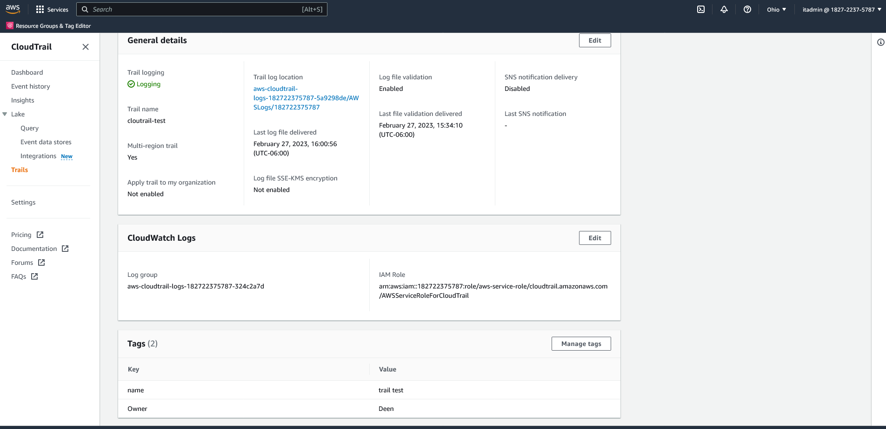
  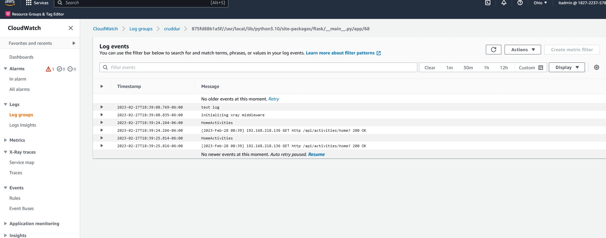

- I instrument Honeycomb with OTEL
  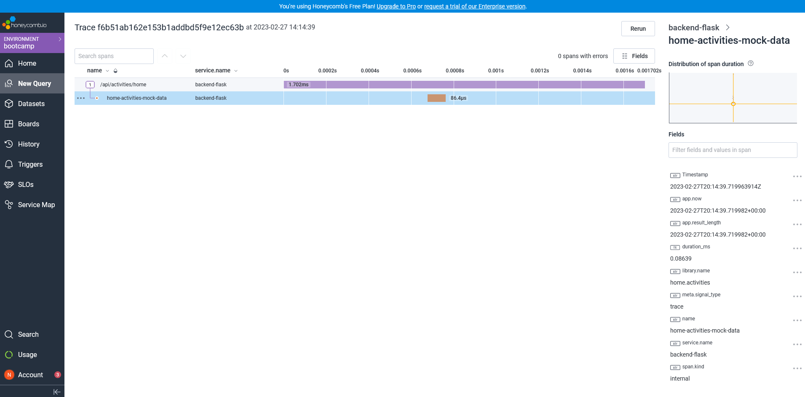
  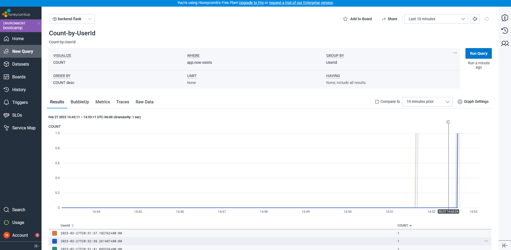

- Watched AWS X-Ray Video and Instrument AWS X-Ray
  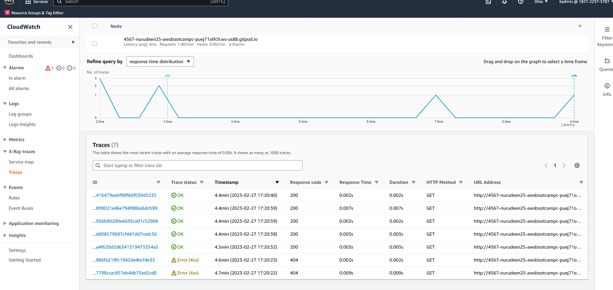
  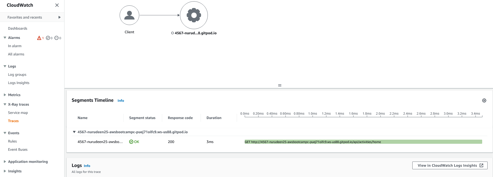

- Watched the week-2 CloudWatch Logs video and Configure custom logger to send to CloudWatch Logs
  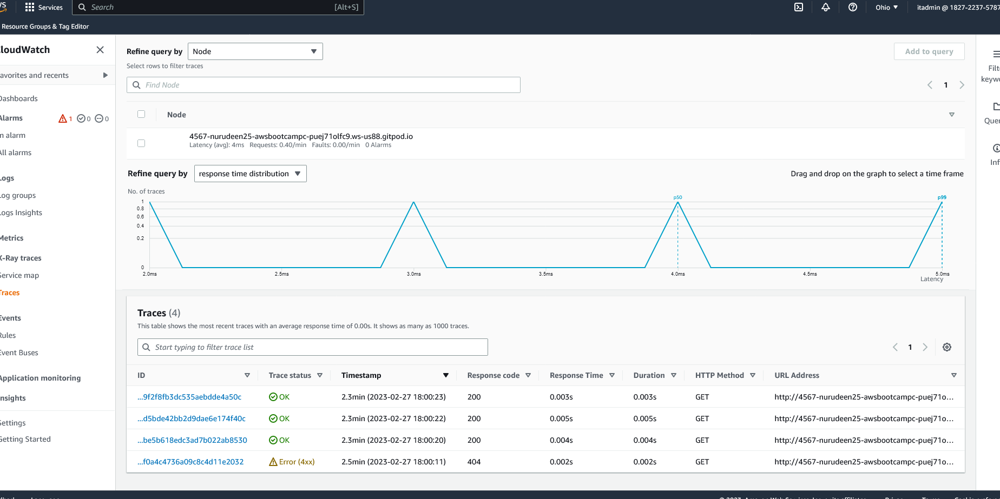
  
- I implement Rollbar, capture error and integrate with slack to send notifications of any error, either critical or warning that needs immediate attention 
  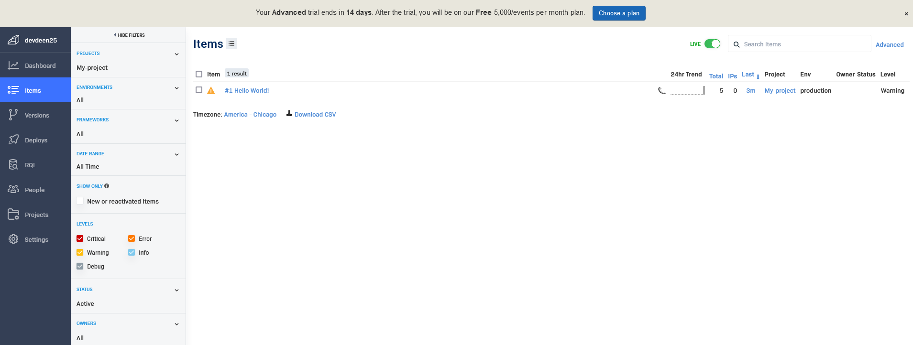
  
  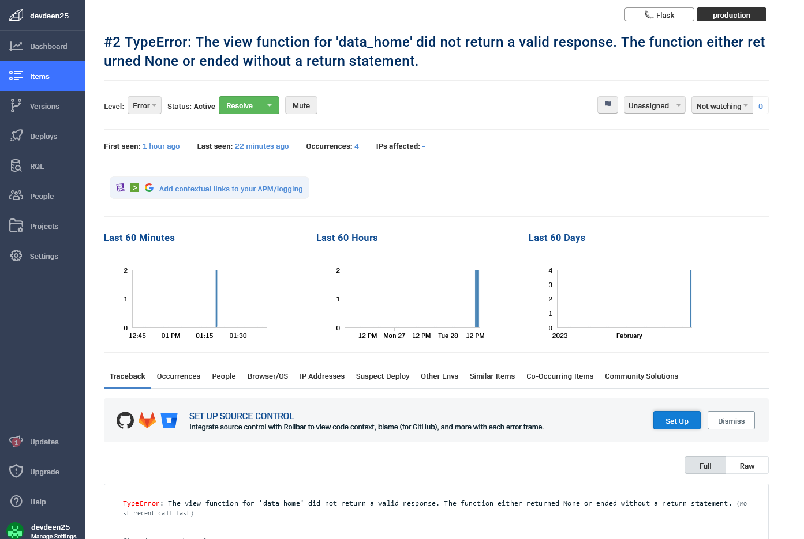
  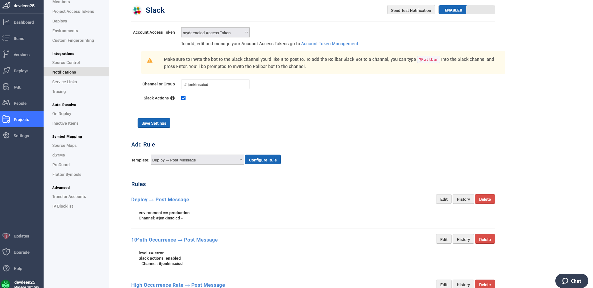
  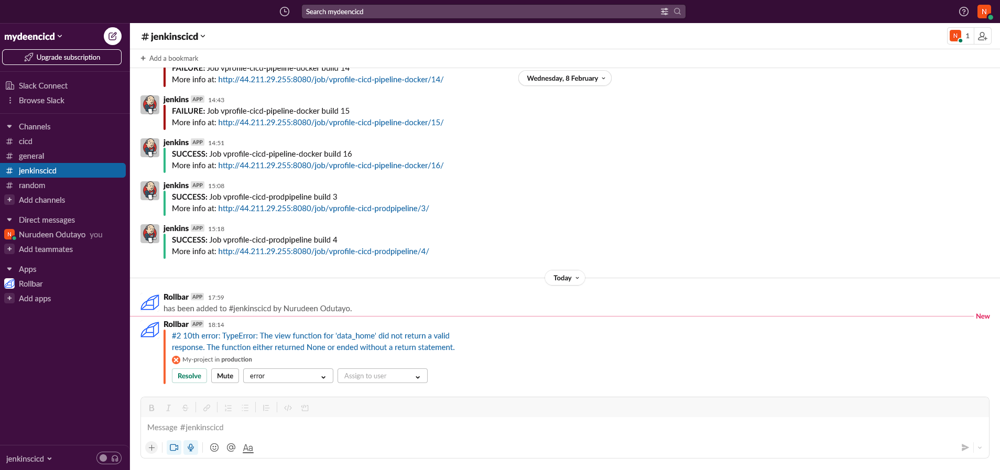
