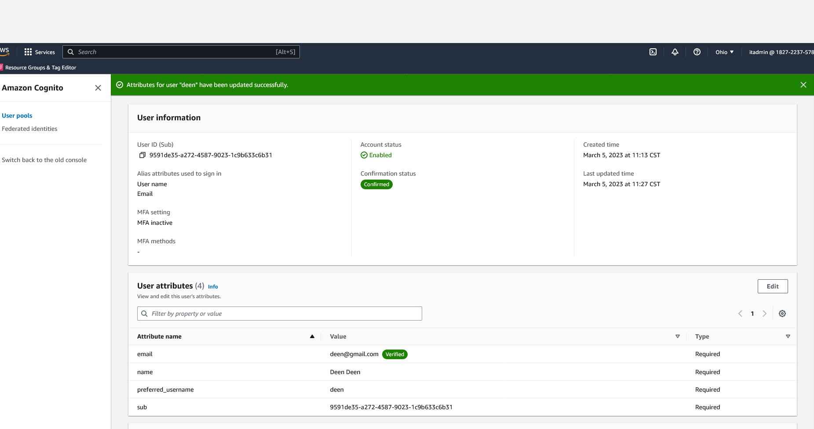
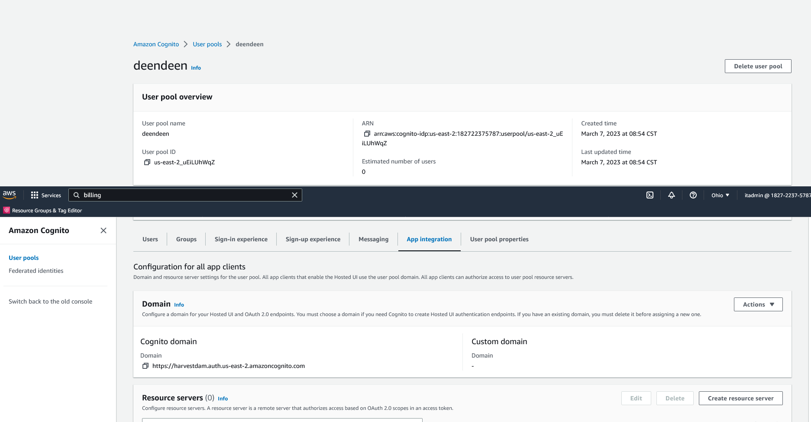
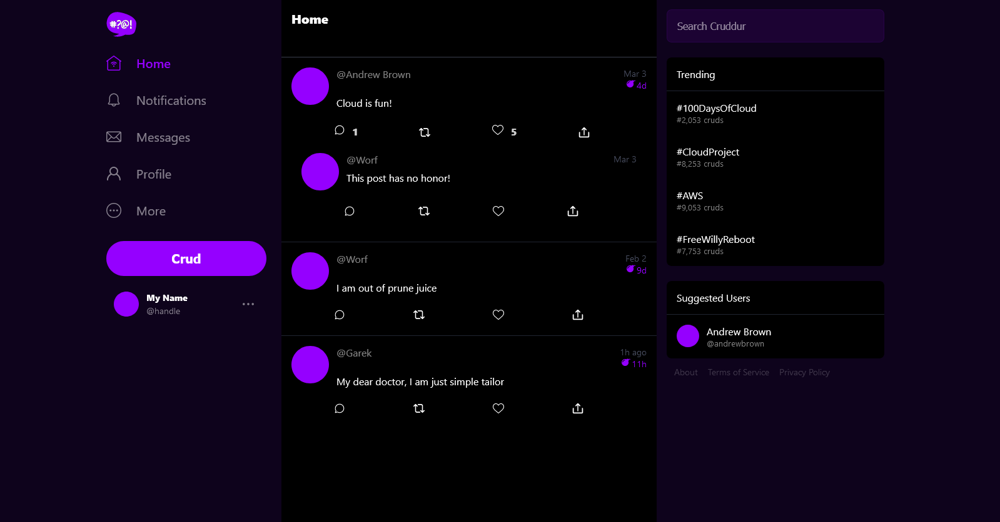
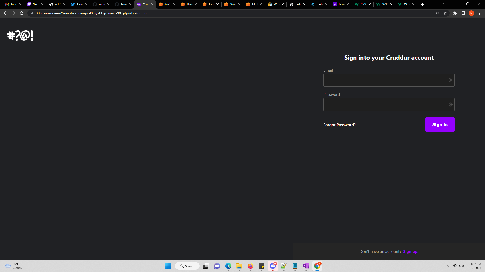
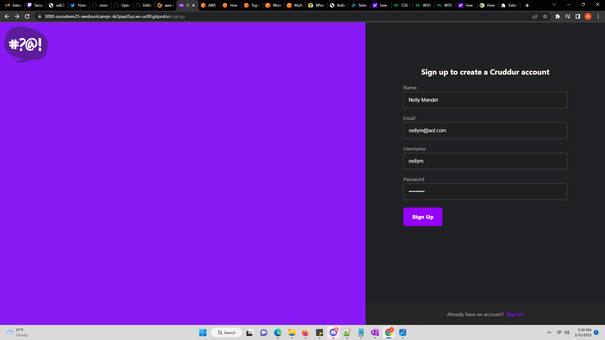
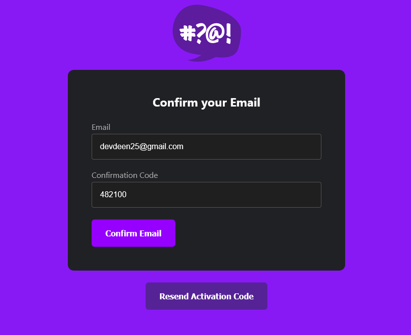
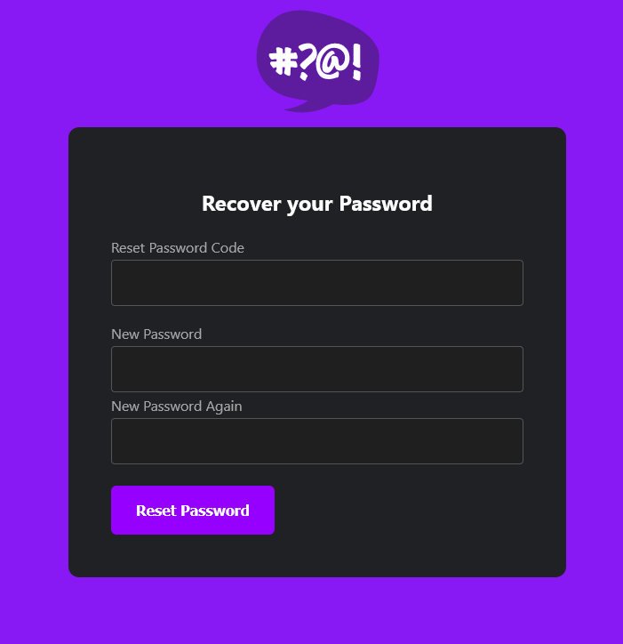
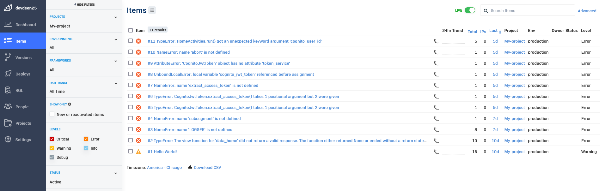
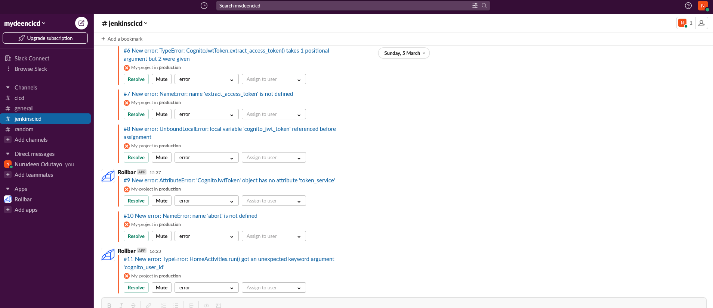
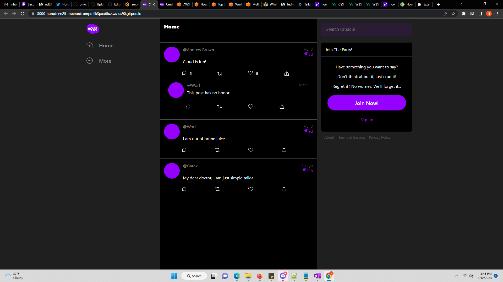

# Week 3 — Decentralized Authentication

HERE ARE THE OVERVIEW FOR WEEK-3 (Mar4-11)

- Watched Ashish's Week 3 - Decentralized Authentication

- Setup Cognito User Pool

 

 

- Implement a Custom Sign in Page

 
 

- Implement a Custom Sign up Page

  

- Implement a Custom Confirmation Page

  

- Implement Custom Recovery Page

  

- Received Rollbar notifications on slack for errors and failures on the application with metrics to monitor the application performance

  
  
  

- Improved UI contrast and implemented CSS variables for theming to increase accessibility, by implementing a color palette

  
  
  

  

