# Week 4 — Postgres and RDS

- Watched Ashish's Week 4 - Security Considerations

- Created RDS Postgres Instance
  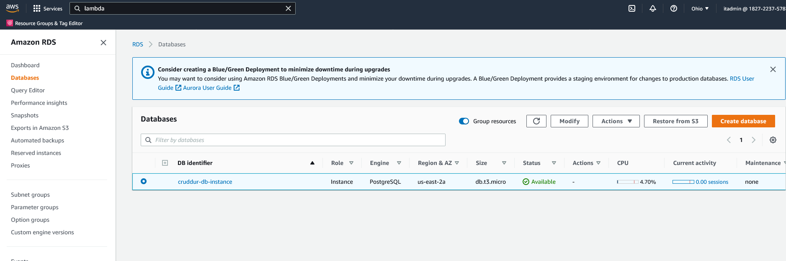
  
- Created Lambda function and created IAM role and attach customer-managed policy to my role for Lambda VPC to allow execution
  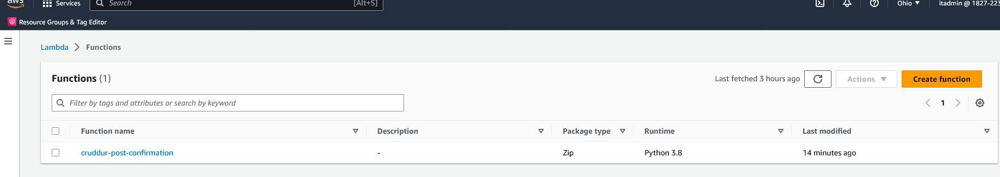
  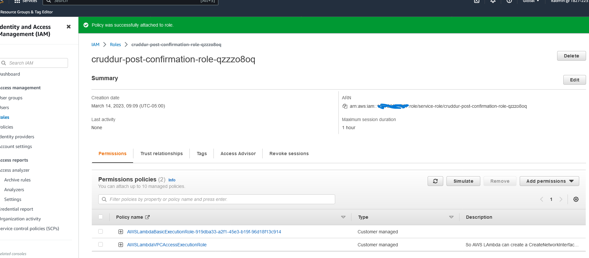

- Bash scripting for common database actions by creating bash scripts to integrate psql db and tables
  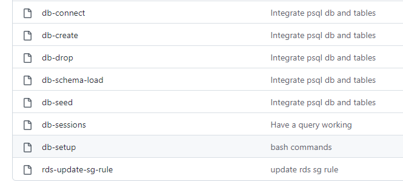

- Install Postgres Driver in the Backend Application, Added Psycopg in my Lambda env for interacting with PostgreSQL 
  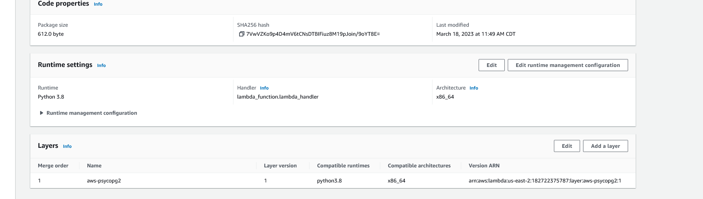

- Connect Gitpod to RDS Instance
  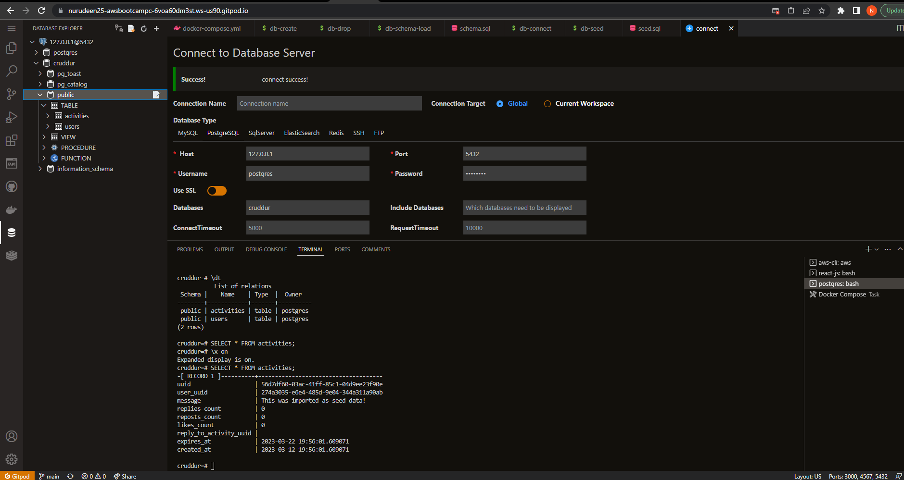

- Created Cognito Trigger to insert a user into the database
  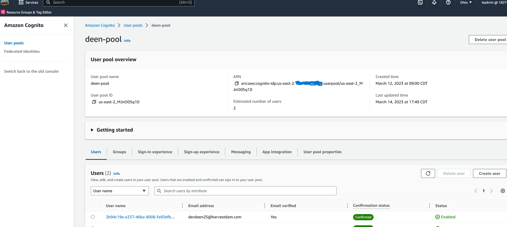
  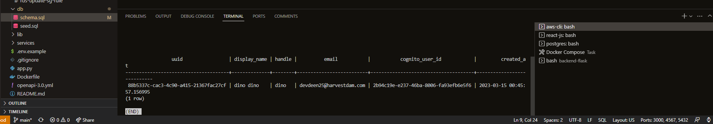
  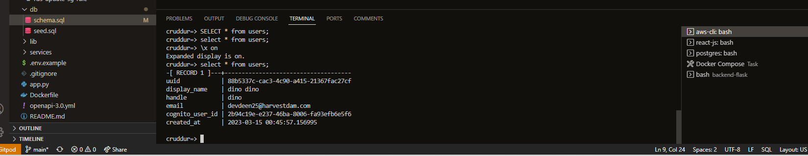
  

- Created new activities with a database insert. This is a challenge to me after writing the code and finding out the post activities are not posted on my homepage. I     mitigate the impact gather observations and tried to resolve it but I still can't, I did ask for help on discord and I follow the steps that were suggested, and still   not working and I end up complicating things. 

  This is how I resolve the problem - After so many commits, I had to check on the git log and revert all my commits back to the state I'm confident in, then I have to     rewrite all my code again and implement the idea from the students on discord and I was able to fix the problem and meet the submission timeline.
  
  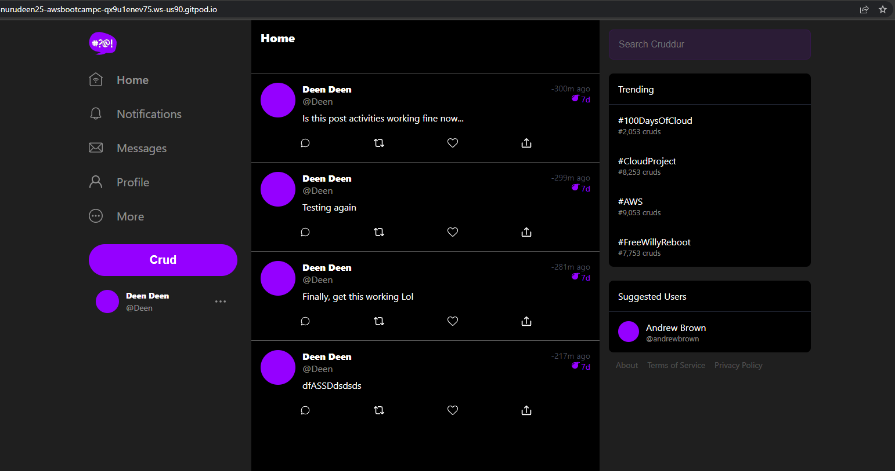
  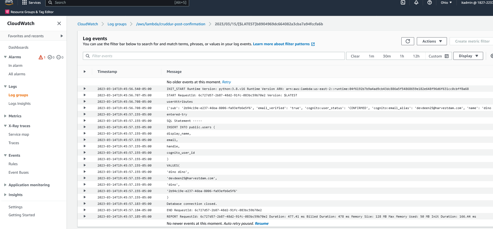
