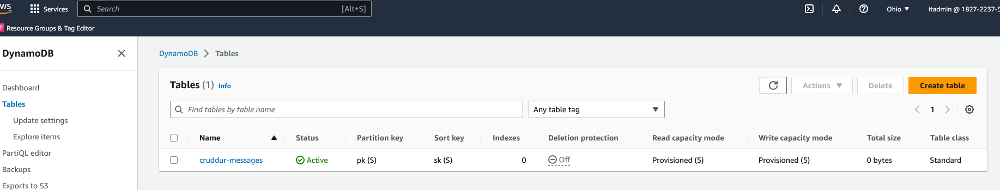

# Week 5 — DynamoDB and Serverless Caching

HERE ARE THE OVERVIEW FOR WEEK-5 (Mar18-25)

- I Watched Week 5 - Data Modelling (Live Stream)

- I Watched Ashish's Week 5 - DynamoDB Considerations

- I implement Schema Load Script, Seed Script, and Scan Script
  
  

- I implement Pattern Scripts for Read and List Conversations
  

- I implement and Update Cognito ID Script for Postgres Database
  

- I implement (Pattern A) Listing Messages in Message Group into the Application
  

- I implement (Pattern B) Listing Messages Group into the Application 
  

- I implement (Pattern C) Creating a Message for an existing Message Group into the Application
  

- I implement (Pattern D) Creating a Message for a new Message Group into the Application
  

- I implement (Pattern E) Updating a Message Group using DynamoDB Streams
  
  
