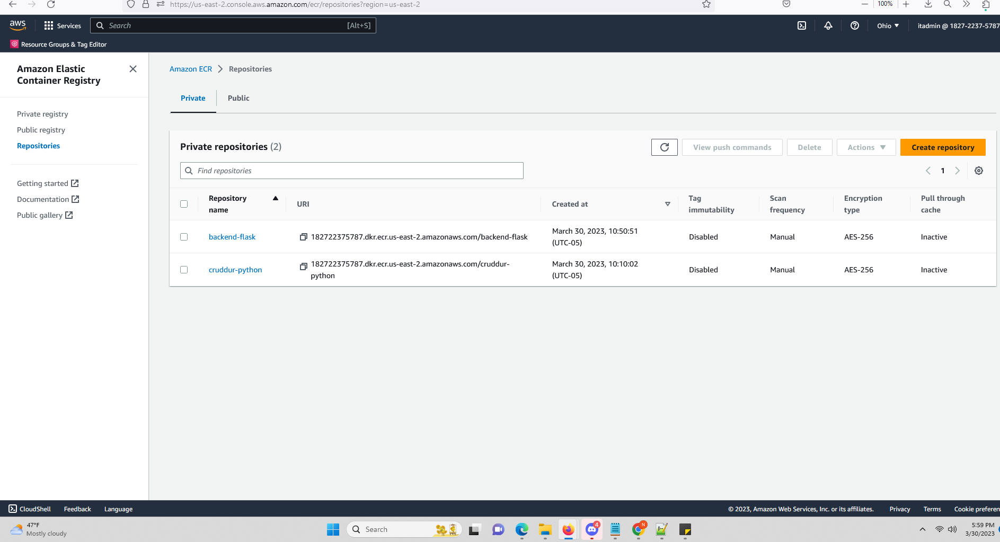

# Week 6 — Deploying Containers

HERE ARE THE OVERVIEW FOR WEEK-6-7 (Mar25-April-8)

```sh
Watch ECS Security by Ashish
```

- I Provision ECS Cluster
  

- I Create ECR repo using AWS CLI and push image for backend-flask
  
  
  
```sh
  Install Postgres Driver in the Backend Application
```

- I Deploy Backend Flask app as a service to Fargate
  

- I Create ECR repo using AWS CLI and push image for fronted-react-js
  

- I Deploy Frontend React JS app as a service to Fargate
  

- I Provision and configure Application Load Balancer along with target groups
  
  
  
  
- Manage my domain using Route53 via hosted zone
  
  
- I Create an SSL cerificate via ACM
  

- I Setup a record set for naked domain to point to frontend-react-js
  
  
  

- I Implement and Setup a record set for api subdomain to point to the backend-flask
  

- Configure CORS to only permit traffic from our domain
  

- I Implement Secure Flask by not running in debug mode
  

```sh
Implement Refresh Token for Amazon Cognito
```

- I Refactor bin directory to be top level
  

- I Configure task defintions to contain x-ray and turn on Container Insights
  
  
  
```sh
Change Docker Compose to explicitly use a user-defined network
Create Dockerfile specfically for production use case
Using ruby generate out env dot files for docker using erb templates
```
