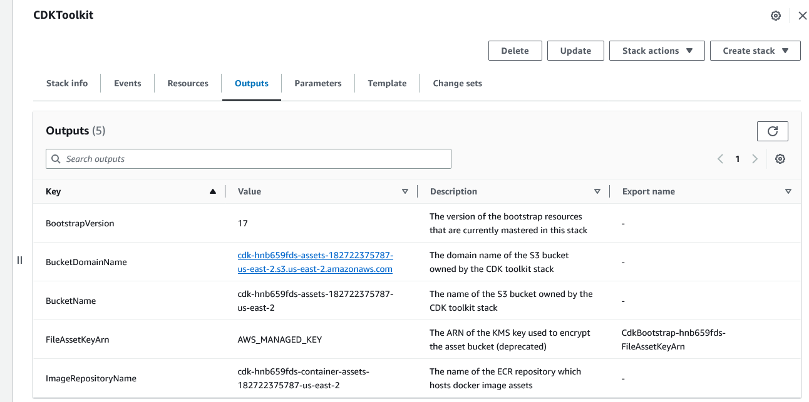
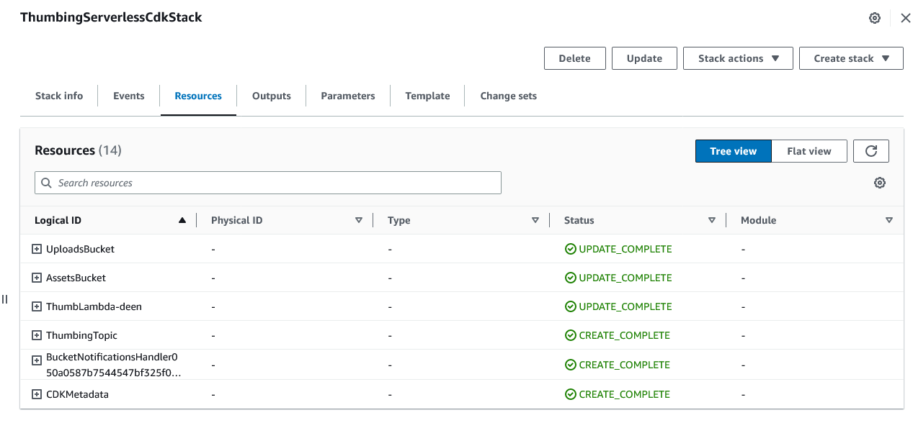
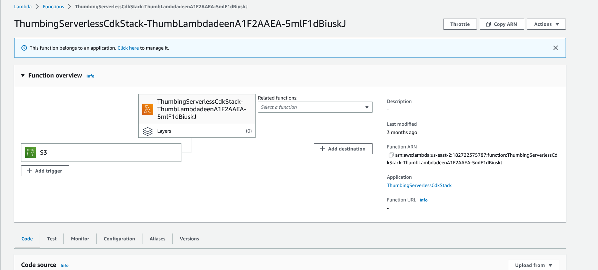
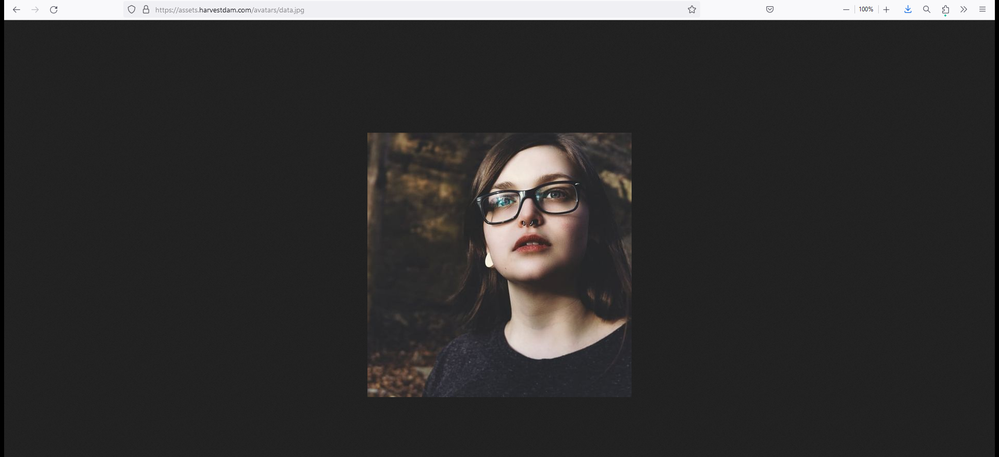
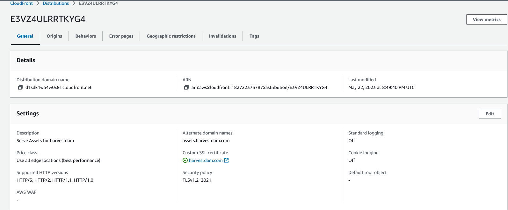
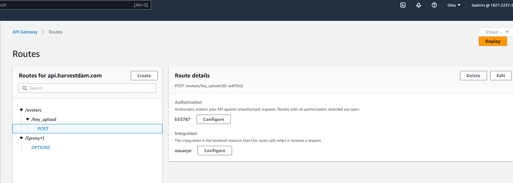
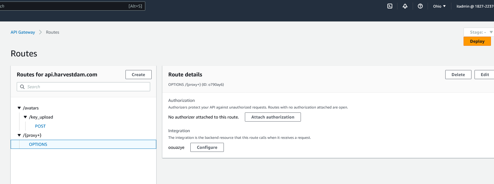
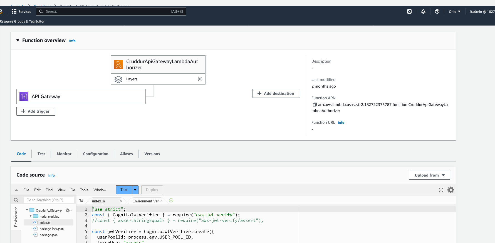
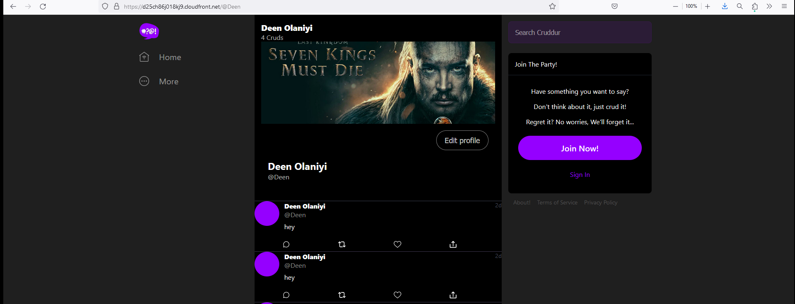

- Implement CDK Stack
- Serve Avatars via CloudFront
- Implement Users Profile Page
- Implement Users Profile Form
- Implement Backend Migrations
- Presigned URL generation via Ruby Lambda
- HTTP API Gateway with Lambda Authorizer
- Create JWT Lambda Layer
- Render Avatars in App via CloudFront

CDK Stack
```sh
CDK stands for AWS Cloud Development Kit. It is an open-source software development framework provided by Amazon Web Services (AWS) that enables developers to define cloud infrastructure resources using familiar programming languages such as TypeScript, Python, Java, and C#. CDK allows you to define your infrastructure as code (IaC), providing a higher level of abstraction compared to traditional template-based approaches like AWS CloudFormation.
```

I have to bootstrap my environment first, based on your region - if you are using different regions you have to bootstrap in all the regions. CMD to run this,
```sh
cdk bootstrap cdk bootstrap "aws://accountid/REGION"
```

I create a thumbing-serverless-cdk directory and cd inside the directory, and provision AWS CDK environment using cmd
```sh
npm install aws-cdk -g

```
Next, is to initialize the CDK Application using the language of my choice, I will be using typescript
```sh
cdk init app --language typescript
```

We have bin and lib directory in the folders and inside the lib folder, we have out stack file where we will define all our code. We have to import every service you want to provision on AWS.
```sh
import * as cdk from "aws-cdk-lib";
import { Construct } from "constructs";
import * as s3 from "aws-cdk-lib/aws-s3";

export class ThumbingServerlessCdkStack extends cdk.Stack {
  constructor(scope: Construct, id: string, props?: cdk.StackProps) {
    super(scope, id, props);

    // The code that defines your stack goes here
    const bucketName: string = process.env.THUMBING_BUCKET_NAME as string;
    const bucket = this.createBucket(bucketName);
  }

  createBucket(bucketName: string): s3.IBucket {
    const bucket = new s3.Bucket(this, "ThumbingBucket", {
      bucketName: bucketName,
      removalPolicy: cdk.RemovalPolicy.DESTROY,
    });
    return bucket;
  }
}
```

You can run cdk synth to show you an overview of what you are implementing and cdk deploy to actually deploy the infrastructure
```sh
cdk synth
cdk deploy
```


You can use either let or const to write your code

To load ENV Variables, we need to create file name .env and install dotenv with this cmd
```sh
npm i dotenv
```

This is what the .env file look like
```sh
UPLOADS_BUCKET_NAME="harvestdam-uploaded-avatars"
ASSETS_BUCKET_NAME="assets.harvestdam.com"
THUMBING_S3_FOLDER_OUTPUT="avatars/processed"
THUMBING_WEBHOOK_URL="https://api.harvestdam.com/webhooks/avatar"
THUMBING_TOPIC_NAME="harvestdam-assets"
THUMBING_FUNCTION_PATH="/workspace/aws-bootcamp-cruddur-2023/aws/lambdas/process-images"
```

Need to modify the thumbing-serverless-cdk-stack.ts file with lambda code functions to process the image with the s3 bucket
To view the thumbing-serverless-cdk-stack.ts file, head here  [thumbing-serverless-cdk-stack.ts](https://github.com/Nurudeen25/aws-bootcamp-cruddur-2023/blob/main/thumbing-serverless-cdk/lib/thumbing-serverless-cdk-stack.ts)




CDK API REFERENCE documentation so good, it gives you more insight. To learn more head here -
```sh
https://docs.aws.amazon.com/cdk/api/v2/docs/aws-construct-library.html
```
NOTE: Removal policy in CDK means if you delete something in your bucket, you can either retain or destroy it.

Serve Avatars via CloudFront





Implement User Profile Page
To view the UserFeedPage.js [UserFeedPage.js](https://github.com/Nurudeen25/aws-bootcamp-cruddur-2023/blob/main/frontend-react-js/src/pages/UserFeedPage.js)
To view the UserFeedPage.js [ProfileForm.js](https://github.com/Nurudeen25/aws-bootcamp-cruddur-2023/blob/main/frontend-react-js/src/components/ProfileForm.js)

Implement Backend Migrations
To view the migrate file [migrate](https://github.com/Nurudeen25/aws-bootcamp-cruddur-2023/blob/main/bin/db/migrate)
To view the rollback migration file [rollback](https://github.com/Nurudeen25/aws-bootcamp-cruddur-2023/blob/main/bin/db/rollback)

Presigned URL generation via Ruby Lambda
I create function.rb file, To view the file head here [function.rb](https://github.com/Nurudeen25/aws-bootcamp-cruddur-2023/blob/main/aws/lambdas/cruddur-upload-avatar/function.rb)

To create a Gemfile, you have to be in the folder and use this cmd
```sh
bundle init
bundle install
```

Implement HTTP API Gateway with Lambda Authorizer
To view the Lambda authorizer template, head here [index.js](https://github.com/Nurudeen25/aws-bootcamp-cruddur-2023/blob/main/aws/lambdas/lambda-authorizer/index.js)

To install the aws-jwt-verify package, make sure you are in the lambda_authorizer folder and run 
```sh
npm install aws-jwt-verify
```
To install zip and zip the lambda_authorizer folder with this cmd
```sh
sudo apt install zip .
zip -r lambda_authorizer.zip .
```
Download the zip file to your local system, Sign in to your AWS console, Go to Lambda, and upload this zip file to your CruddurApiGatewayLambdaAuthorizer lambda function.





Render Avatars in App via CloudFront

