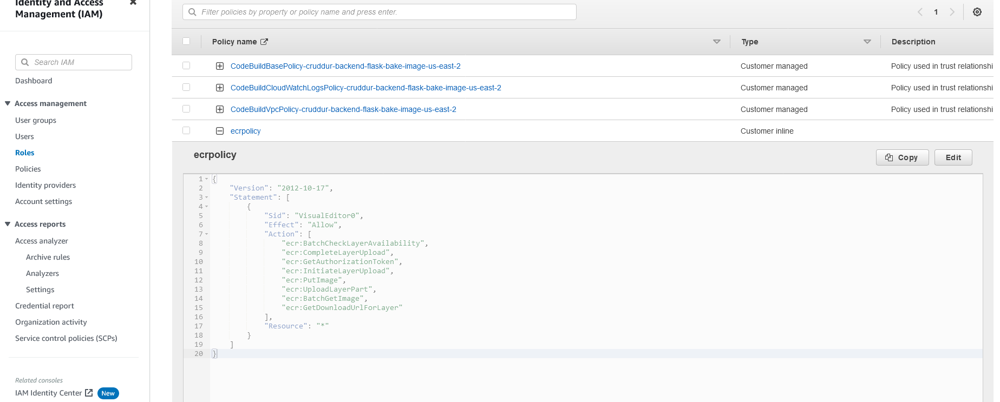
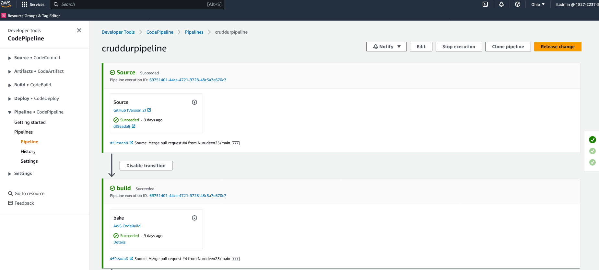
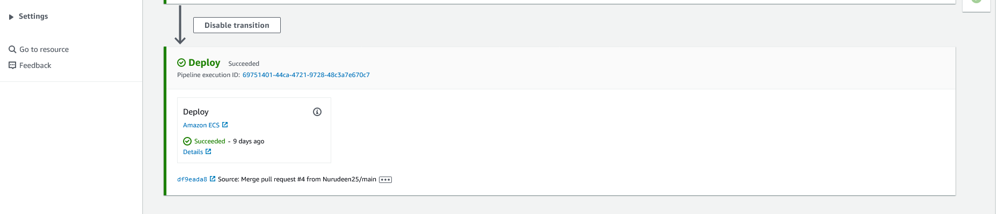

# Week 9 — CI/CD with CodePipeline, CodeBuild and CodeDeploy

HERE IS THE OVERVIEW FOR WEEK-9

```sh
I created Build Project on CI/CD pipeline, the Source provider is my GitHub repository, 
with an environment image Amazon Linux 2 and I created an IAM role. 
I have my buildspec.yml file in my git repository 
# [buildspec-file](https://github.com/Nurudeen25/aws-bootcamp-cruddur-2023/blob/main/backend-flask/buildspec.yml)
I start the build the source will scan my repository and test it, 
after that, it will transit to build do code analysis, test it, upload the artifact which is a docker image, 
and then transit to code pipeline which will deploy it to Amazon ECS backend cluster.
```





