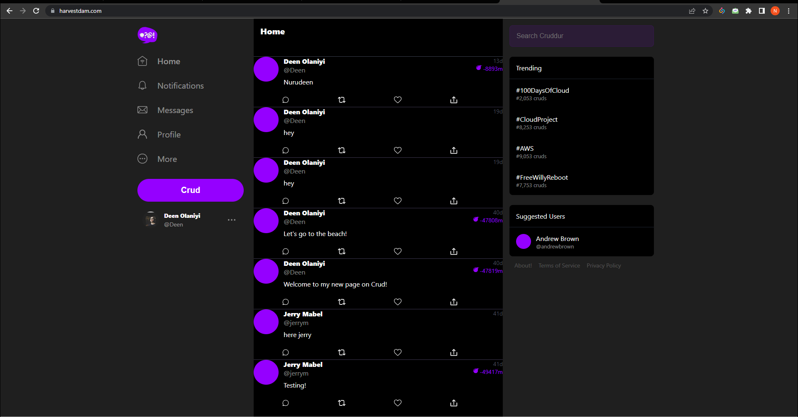
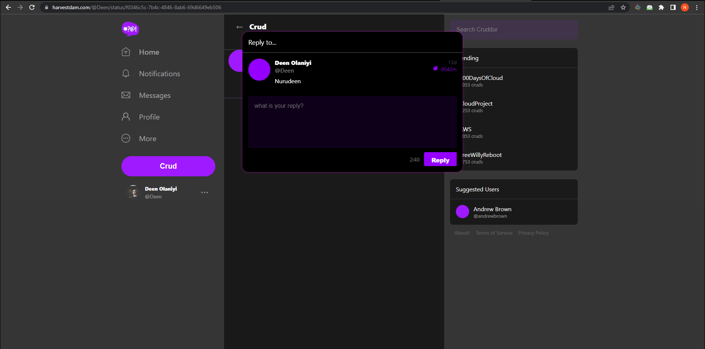

# Week X — Final Submission

Todo Checklist

- Week X Sync tool for static website hosting
- Reconnect DB and Postgres Confirmation Lambda
- Fix CORS to use the domain name for web-app
- Ensure CI/CD pipeline works and create activity works
- Refactor to use JWT Decorator in Flask App
- Refactor Flask Routes
- Implement Replies for Posts
- Improved Error Handling for the app
- Activities Show Page
- More General Cleanup Part 1 and Part 2

I implement the Sync tool for static website hosting. 
I had to create a bash script for the frontend static build
```sh

#! /usr/bin/bash

ABS_PATH=$(readlink -f "$0")
FRONTEND_PATH=$(dirname $ABS_PATH)
BIN_PATH=$(dirname $FRONTEND_PATH)
PROJECT_PATH=$(dirname $BIN_PATH)
FRONTEND_REACT_JS_PATH="$PROJECT_PATH/frontend-react-js"

cd $FRONTEND_REACT_JS_PATH

REACT_APP_BACKEND_URL="" \
REACT_APP_AWS_PROJECT_REGION="$AWS_DEFAULT_REGION" \
REACT_APP_AWS_COGNITO_REGION="$AWS_DEFAULT_REGION" \
REACT_APP_AWS_USER_POOLS_ID="" \
REACT_APP_CLIENT_ID="" \
npm run build
```

Next is to have to sync data and validate it. Create a file name sync under the bin/frontend DIR. Create ruby bin script for that and install the dependency with the command gem install aws_s3_website_sync
```sh
#!/usr/bin/env ruby

require 'aws_s3_website_sync'

  puts "sync =="
  AwsS3WebsiteSync::Runner.run(
    aws_access_key_id:     ENV["AWS_ACCESS_KEY_ID"],
    aws_secret_access_key: ENV["AWS_SECRET_ACCESS_KEY"],
    aws_default_region:    ENV["AWS_DEFAULT_REGION"],
    s3_bucket:             ENV["S3_BUCKET"],
    distribution_id:       ENV["CLOUDFRONT_DISTRUBTION_ID"],
    build_dir:             ENV["BUILD_DIR"],
    output_changset_path:  ENV["OUTPUT_CHANGESET_PATH"],
    auto_approve:          ENV["AUTO_APPROVE"],
    silent: "ignore,no_change",
    ignore_files: [
      'stylesheets/index',
      'android-chrome-192x192.png',
      'android-chrome-256x256.png',
      'apple-touch-icon-precomposed.png',
      'apple-touch-icon.png',
      'site.webmanifest',
      'error.html',
      'favicon-16x16.png',
      'favicon-32x32.png',
      'favicon.ico',
      'robots.txt',
      'safari-pinned-tab.svg'
    ]
  )
end
```

Next is to generate sync env ./bin/frontend/generate-env 
Then implement OCID to integrate with GitHub actions. Navigate to AWS-console-IAM- identity provider and OpenID Connect

I have to merge the main branch to the prod branch on GitHub, The code has to be the same before it is pushed to production.
The cmd below is for the static build and sync frontend.
```sh
./bin/frontend/static-build 
./bin/frontend/sync
```
Next is to navigate to your AWS console, CloudFront, and the invalidation of the Cloudfront.

- I implement Reconnect DB and Postgres Confirmation Lambda
 I do establish a local connection and do update the Prod DB connection and migrate with this command
```sh
CONNECTION_URL=$PROD_CONNECTION_URL ./bin/db/migrate
```
I created a script to update CrdALBSG to have access to the new RDS DB SG
```sh
#! /usr/bin/bash


CYAN='\033[1;36m'
NO_COLOR='\033[0m'
LABEL="rds-update-sg-rule"
printf "${CYAN}== ${LABEL}${NO_COLOR}\n"

aws ec2 modify-security-group-rules \
    --group-id $DB_SG_ID \
    --security-group-rules "SecurityGroupRuleId=$DB_SG_RULE_ID,SecurityGroupRule={Description=GITPOD,IpProtocol=tcp,FromPort=5432,ToPort=5432,CidrIpv4=$GITPOD_IP/32}"
```

- I update the Post Confirmation Lambda
- I updated the environment variables- CONNECTION_URL to the new RDS DB URL
- I updated the environment variables for VPC and subnets for cruddur-post-confirmation lambda
Now it is updated with the correct details.

- I Fix CORS to use domain name for web-app
I update the aws/cfn/service/config.toml with the parameters env variables for frontend and backend, set the variables starting from https:// and navigate to your AWS console - API GATEWAY- and ensure the CORS is clear.
Next is to use the command to update the service up and running
```sh
./bin/cfn/service
```

- I Ensure CI/CD pipeline works and create activity works
I updated the ./bin/db/update_cognito_user_ids to use the cognito_user_id and not user_handle
I updated the create_activity to use the cognito_user_id and not user_handle
I updated the ActivityForm and import getAccessToken for CheckAuth
I updated /backend-flask/db/sql/activities/create.sql to use the cognito_user_id
I added BatchGetBuilds to CodeBuild permission in aws/cfn/cicd/template.yaml

I created buildspec.yml file under the backend-flask DIR
To view the buildspec.yml file, head here [buildspec.yml](https://github.com/Nurudeen25/aws-bootcamp-cruddur-2023/blob/main/backend-flask/buildspec.yml)

- I Refactor to use JWT Decorator in Flask App
I updated the ReplyForm.js to apply the close event, same thing we did in our ProfileForm.js
```sh
const close = (event) => {
    if (event.target.classList.contains("reply_popup")) {
      props.setPopped(false);
    }
  };
```
I updated the backend-flask/lib/cognito_jwt_token.py with the decorator function
```sh
def jwt_required(f=None, on_error=None):
    if f is None:
        return partial(jwt_required, on_error=on_error)

    @wraps(f)
    def decorated_function(*args, **kwargs):
        cognito_jwt_token = CognitoJwtToken(
            user_pool_id=os.getenv("AWS_COGNITO_USER_POOL_ID"), 
            user_pool_client_id=os.getenv("AWS_COGNITO_USER_POOL_CLIENT_ID"),
            region=os.getenv("AWS_DEFAULT_REGION")
        )
        access_token = extract_access_token(request.headers)
        try:
            claims = cognito_jwt_token.verify(access_token)
            # is this a bad idea using a global?
            g.cognito_user_id = claims['sub']  # storing the user_id in the global g object
        except TokenVerifyError as e:
            # unauthenticated request
            app.logger.debug(e)
            if on_error:
                return on_error(e)
            return {}, 401
        return f(*args, **kwargs)
    return decorated_function
```
Next is to import these tools in cognito_jwt_token.py, it is what is used for making decorators.

- I implement and Refactor app.py with the NotificationsFeedPage.js
To view the app.py, head here [app.py](https://github.com/Nurudeen25/aws-bootcamp-cruddur-2023/blob/main/backend-flask/app.py)
To view the NotificationsFeedPage.js, head here [NotificationsFeedPage.js](https://github.com/Nurudeen25/aws-bootcamp-cruddur-2023/blob/main/frontend-react-js/src/pages/NotificationsFeedPage.js)

I created rollbar.py file inside the backend-flask/lib/ DIR
```sh
from flask import current_app as app
from flask import got_request_exception, g
from time import strftime
import os
import rollbar
import rollbar.contrib.flask

def init_rollbar(app):
  rollbar_access_token = os.getenv('ROLLBAR_ACCESS_TOKEN')
  rollbar.init(
      # access token
      rollbar_access_token,
      # environment name
      'production',
      # server root directory, makes tracebacks prettier
      root=os.path.dirname(os.path.realpath(__file__)),
      # flask already sets up logging
      allow_logging_basic_config=False)
  # send exceptions from `app` to rollbar, using flask's signal system.
  got_request_exception.connect(rollbar.contrib.flask.report_exception, app)
  return rollbar
```
I created a file for xray.py inside the backend-flask/lib DIR
```sh
import os
from aws_xray_sdk.core import xray_recorder
from aws_xray_sdk.ext.flask.middleware import XRayMiddleware

def init_xray(app):
  xray_url = os.getenv("AWS_XRAY_URL")
  xray_recorder.configure(service='backend-flask', dynamic_naming=xray_url)
  XRayMiddleware(app, xray_recorder)
```
I created a file for honeycomb.py inside the backend-flask/lib DIR
```sh
from opentelemetry import trace
from opentelemetry.instrumentation.flask import FlaskInstrumentor
from opentelemetry.instrumentation.requests import RequestsInstrumentor
from opentelemetry.exporter.otlp.proto.http.trace_exporter import OTLPSpanExporter
from opentelemetry.sdk.trace import TracerProvider
from opentelemetry.sdk.trace.export import BatchSpanProcessor
from opentelemetry.sdk.trace.export import ConsoleSpanExporter, SimpleSpanProcessor

provider = TracerProvider()
processor = BatchSpanProcessor(OTLPSpanExporter())
provider.add_span_processor(processor)

# OTEL ----------
# Show this in the logs within the backend-flask app (STDOUT)
#simple_processor = SimpleSpanProcessor(ConsoleSpanExporter())
#provider.add_span_processor(simple_processor)

trace.set_tracer_provider(provider)
tracer = trace.get_tracer(__name__)

def init_honeycomb(app):
  FlaskInstrumentor().instrument_app(app)
  RequestsInstrumentor().instrument()
```
I created a file for cors.py inside the backend-flask/lib DIR
```sh
from flask_cors import CORS
import os

def init_cors(app):
  frontend = os.getenv('FRONTEND_URL')
  backend = os.getenv('BACKEND_URL')
  origins = [frontend, backend]
  cors = CORS(
    app, 
    resources={r"/api/*": {"origins": origins}},
    headers=['Content-Type', 'Authorization'], 
    expose_headers='Authorization',
    methods="OPTIONS,GET,HEAD,POST"
  )
```
I created a file for cloudwatch.py inside the backend-flask/lib DIR
```sh
import watchtower
import logging
from flask import request


def init_cloudwatch(response):
  timestamp = strftime('[%Y-%b-%d %H:%M]')
  LOGGER.error('%s %s %s %s %s %s', timestamp, request.remote_addr, request.method, request.scheme, request.full_path, response.status)
  return response
```

- I Refactor Flask Routes, created activities.py inside the backend-flask/routes DIR
```sh
## flask
from flask import request, g

## decorators
from aws_xray_sdk.core import xray_recorder
from lib.cognito_jwt_token import jwt_required
from flask_cors import cross_origin

## services
from services.home_activities import *
from services.notifications_activities import *
from services.create_activity import *
from services.search_activities import *
from services.create_reply import *

## helpers
from lib.helpers import model_json

def load(app):
  def default_home_feed(e):
    app.logger.debug(e)
    app.logger.debug("unauthenicated")
    data = HomeActivities.run()
    return data, 200

  @app.route("/api/activities/home", methods=['GET'])
  #@xray_recorder.capture('activities_home')
  @jwt_required(on_error=default_home_feed)
  def data_home():
    data = HomeActivities.run(cognito_user_id=g.cognito_user_id)
    return data, 200

  @app.route("/api/activities/notifications", methods=['GET'])
  def data_notifications():
    data = NotificationsActivities.run()
    return data, 200

  @app.route("/api/activities/search", methods=['GET'])
  def data_search():
    term = request.args.get('term')
    model = SearchActivities.run(term)
    return model_json(model)

  @app.route("/api/activities", methods=['POST','OPTIONS'])
  @cross_origin()
  @jwt_required()
  def data_activities():
    message = request.json['message']
    ttl = request.json['ttl']
    model = CreateActivity.run(message, g.cognito_user_id, ttl)
    return model_json(model)

  @app.route("/api/activities/<string:activity_uuid>/reply", methods=['POST','OPTIONS'])
  @cross_origin()
  @jwt_required()
  def data_activities_reply(activity_uuid):
    message = request.json['message']
    model = CreateReply.run(message, g.cognito_user_id, activity_uuid)
    return model_json(model)
```
I updated the backend-flask/routes/messages.py file to use congnito_user_id
To view the messages.py template, head here [messages.py](https://github.com/Nurudeen25/aws-bootcamp-cruddur-2023/blob/main/backend-flask/routes/messages.py)

I updated the backend-flask/routes/users.py file to use congnito_user_id and users bio
To view the messages.py template, head here [users.py](https://github.com/Nurudeen25/aws-bootcamp-cruddur-2023/blob/main/backend-flask/routes/users.py)

- I Implement and Refactor Replies for Posts
I updated my create_reply.py not to use the hardcoded handle and be able to use cognito_user_id
```sh
from datetime import datetime, timedelta, timezone

from lib.db import db

class CreateReply:
  def run(message, cognito_user_id, activity_uuid):
    model = {
      'errors': None,
      'data': None
    }

    if cognito_user_id == None or len(cognito_user_id) < 1:
      model['errors'] = ['cognito_user_id_blank']

    if activity_uuid == None or len(activity_uuid) < 1:
      model['errors'] = ['activity_uuid_blank']

    if message == None or len(message) < 1:
      model['errors'] = ['message_blank'] 
    elif len(message) > 1024:
      model['errors'] = ['message_exceed_max_chars_1024'] 

    if model['errors']:
      # return what we provided
      model['data'] = {
        'message': message,
        'reply_to_activity_uuid': activity_uuid
      }
    else:
      uuid = CreateReply.create_reply(cognito_user_id,activity_uuid,message)

      object_json = CreateReply.query_object_activity(uuid)
      model['data'] = object_json
    return model

  def create_reply(cognito_user_id, activity_uuid, message):
    sql = db.template('activities','reply')
    uuid = db.query_commit(sql,{
      'cognito_user_id': cognito_user_id,
      'reply_to_activity_uuid': activity_uuid,
      'message': message,
    })
    return uuid
  def query_object_activity(uuid):
    sql = db.template('activities','object')
    return db.query_object_json(sql,{
      'uuid': uuid
    })
```
The next step is to go inside our backend-flask/db/sql/activities and create reply.sql file
The key difference in this reply.sql template is we have to include reply_to_activity_uuid
```sh
INSERT INTO public.activities (
  user_uuid,
  message,
  reply_to_activity_uuid
)
VALUES (
  (SELECT uuid 
    FROM public.users 
    WHERE users.cognito_user_id = %(cognito_user_id)s
    LIMIT 1
  ),
  %(message)s,
  %(reply_to_activity_uuid)s
) RETURNING uuid;
```
Navigate to backend-flask/db/sql/activities/object.sql and add this
```sh
activities.reply_to_activity_uuid
```
Navigate to backend-flask/db/schmema.sql
We have reply_to_activity_uuid as integer, it should be string to fix this we run migrations to fix that
```sh
./bin/generate/migration reply_to_activity_uuid_to_string
```



I updated ActivityFeed.js for replies
```sh
import './ActivityFeed.css';
import ActivityItem from './ActivityItem';

export default function ActivityFeed(props) {
  let content;
  if (props.activities.length === 0){
    content = <div className='activity_feed_primer'>
      <span>Nothing to see here yet</span>
    </div>
  } else {
    content = <div className='activity_feed_collection'>
      {props.activities.map(activity => {
      return  <ActivityItem setReplyActivity={props.setReplyActivity} setPopped={props.setPopped} key={activity.uuid} activity={activity} />
      })}
    </div>
  }


  return (<div>
    {content}
  </div>
  );
}
```

- Cleanup Part 1 and Part 2
I updated the ddb.py env vars for the new DDB
I have to make sure in every push to GitHub after local testing, I need to create a pull request and merge main branch to prod and the backend CI/CD build will automatically trigger for prod
I static build and sync frontend to S3 and Cloudfront
